


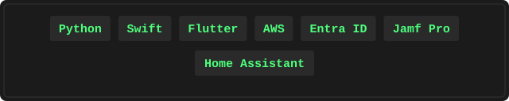

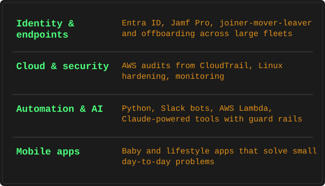

<a href="https://github.com/CaputoDavide93/Jamf-SnipeIT-Suite">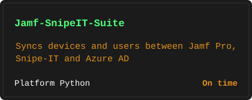</a>
<a href="https://github.com/CaputoDavide93/AWS-OffBoarding-Audit"></a>
<a href="https://github.com/CaputoDavide93/Jamf-WakeUp-Call"></a>
<a href="https://github.com/CaputoDavide93/EC2-Linux-Security-Monitor">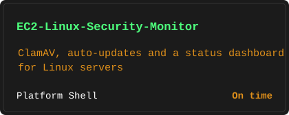</a>

<a href="https://github.com/CaputoDavide93/Mixergy-Home-Assistant">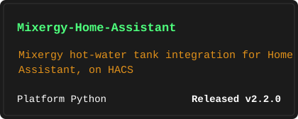</a>
<a href="https://github.com/CaputoDavide93/InkFrame-Immich"></a>
<a href="https://github.com/CaputoDavide93/Kallsup-Sendspin-MusicAssistant">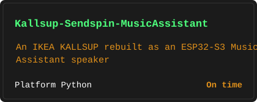</a>
<a href="https://github.com/CaputoDavide93/MacOS-Game-Mode"></a>

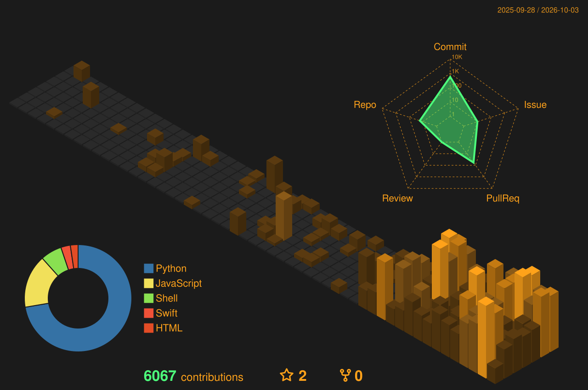

Every block above is drawn from live GitHub data by <a href=".github/workflows/profile-art.yml">a daily workflow</a>.

---

Made with ❤️ by <a href="https://github.com/CaputoDavide93">Davide Caputo</a>

