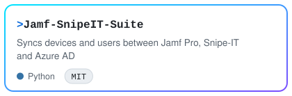
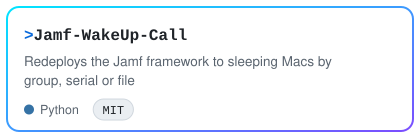
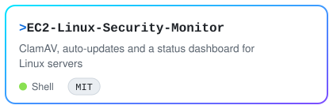
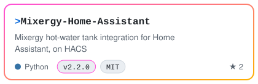
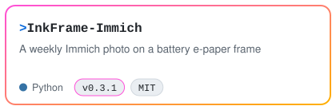
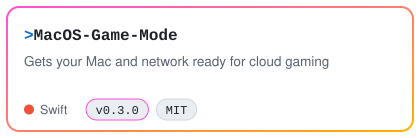
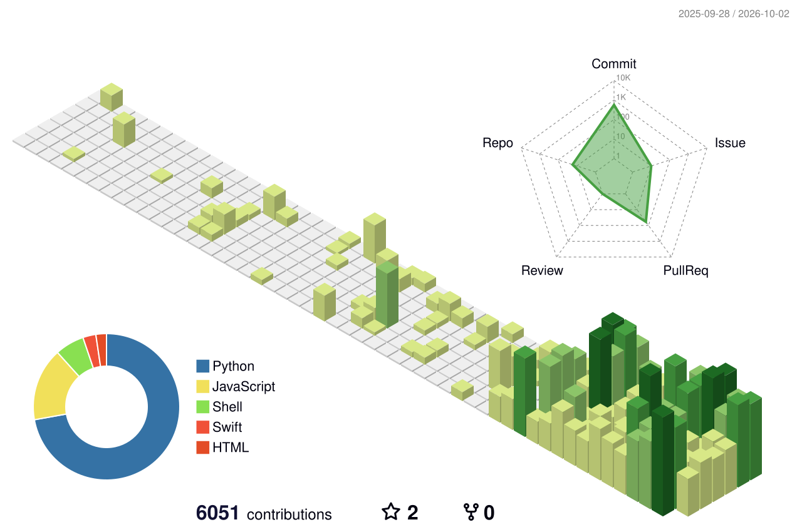

<picture><source media="(prefers-color-scheme: dark)" srcset="docs/assets/header-dark.svg"></picture>

---

## 🧭 Experience

| | Area | Focus |
|---|---|---|
| 🪪 | Identity & endpoints | Entra ID, Jamf Pro, joiner-mover-leaver and offboarding across large fleets |
| ☁️ | Cloud & security | AWS audits from CloudTrail, Linux hardening, monitoring |
| 🤖 | Automation & AI | Python, Slack bots, AWS Lambda, Claude-powered tools with guard rails |
| 📱 | Mobile apps | Baby and lifestyle apps that solve small day-to-day problems |

---

## 💼 Work projects

<a href="https://github.com/CaputoDavide93/Jamf-SnipeIT-Suite"><picture><source media="(prefers-color-scheme: dark)" srcset="docs/assets/cards/Jamf-SnipeIT-Suite-dark.svg"></picture></a>
<a href="https://github.com/CaputoDavide93/AWS-OffBoarding-Audit"><picture><source media="(prefers-color-scheme: dark)" srcset="docs/assets/cards/AWS-OffBoarding-Audit-dark.svg"></picture></a>
<a href="https://github.com/CaputoDavide93/Jamf-WakeUp-Call"><picture><source media="(prefers-color-scheme: dark)" srcset="docs/assets/cards/Jamf-WakeUp-Call-dark.svg"></picture></a>
<a href="https://github.com/CaputoDavide93/EC2-Linux-Security-Monitor"><picture><source media="(prefers-color-scheme: dark)" srcset="docs/assets/cards/EC2-Linux-Security-Monitor-dark.svg"></picture></a>

## 🏡 Home & personal projects

<a href="https://github.com/CaputoDavide93/Mixergy-Home-Assistant"><picture><source media="(prefers-color-scheme: dark)" srcset="docs/assets/cards/Mixergy-Home-Assistant-dark.svg"></picture></a>
<a href="https://github.com/CaputoDavide93/InkFrame-Immich"><picture><source media="(prefers-color-scheme: dark)" srcset="docs/assets/cards/InkFrame-Immich-dark.svg"></picture></a>
<a href="https://github.com/CaputoDavide93/Kallsup-Sendspin-MusicAssistant"><picture><source media="(prefers-color-scheme: dark)" srcset="docs/assets/cards/Kallsup-Sendspin-MusicAssistant-dark.svg"></picture></a>
<a href="https://github.com/CaputoDavide93/MacOS-Game-Mode"><picture><source media="(prefers-color-scheme: dark)" srcset="docs/assets/cards/MacOS-Game-Mode-dark.svg"></picture></a>

Upstream: [merged fix in Home Assistant core](https://github.com/home-assistant/core/pull/183579).

---

## 🏙️ Contributions

<picture><source media="(prefers-color-scheme: dark)" srcset="docs/assets/city-dark.svg"></picture>

<picture><source media="(prefers-color-scheme: dark)" srcset="docs/assets/snake-dark.svg"></picture>

Cards, city and snake are redrawn from live GitHub data by <a href=".github/workflows/profile-art.yml">a daily workflow</a>.

---

Made with ❤️ by <a href="https://github.com/CaputoDavide93">Davide Caputo</a>

